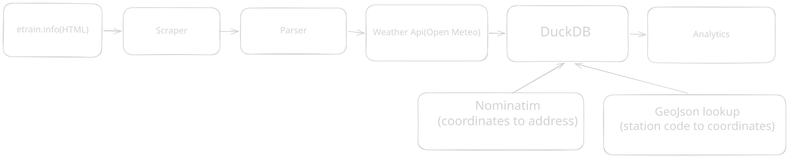

#### *An end-to-end data engineering pipeline that scrapes, processes and analyzes train delay patterns across Northeast India (mainly Assam at current stage)- enriched with weather data to uncover which weather factors contributes the most to delays*

## Pipeline overview
___



## Key Features

**Scraping & Parsing**

- Scrapes 1-year delay history from [etrain.info](http://etrain.info) 
- Parses embedded JSON from raw HTML into structured CSVs
- Skips already-fetched files and re-fetches stale ones automatically

**Weather Integration**

- Fetches historical daily weather (temperature, rainfall, wind, humidity) from the Open-Meteo archive API
- Backfill on first run; **incremental updates** on subsequent runs  only fetches from last recorded date per station, not a full refresh
-  Maps each of 200+ railway stations to `lat` /`long` coordinates via a `GeoJSON` dataset (with manual fallbacks for renamed/missing stations)
- Maps each coordinates to an address (`Nominatim`)

**Data Modeling (DuckDB)**

- Normalized schema: `train_delay`, `weather`, `stations_coordinates`, `station_address`, `train_route`
- Denormalized `merged_view` joining all tables — exported to Parquet for fast dashboard queries
- Idempotent inserts (`INSERT OR IGNORE`) so the pipeline is safe to re-run

**Analytics Dashboard (Streamlit + Plotly)**
[View Streamlit Dashboard](https://ne-train-pipeline-analysis.streamlit.app/?embed_options=dark_theme)

- Overview: total records, trains, stations, avg delay, date range
- Train Analysis: avg vs median delay per train (reveals outlier disruptions)
- Station Analysis: interactive map with delay-scaled bubbles + top 10 worst stations
- Temporal Analysis: delay by season + month × weekday heatmap
- Weather Analysis: scatter plots, violin plots, and correlation heatmap for 4 weather variables
## Tech Stack

| Layer | Tool |
| --- | --- |
| Scraping | `requests`, `BeautifulSoup` |
| Parsing | `BeautifulSoup`, `re`, `pandas` |
| Geo Lookup | GeoJSON dataset + `geopy` (Nominatim) |
| Weather | Open-Meteo Archive API |
| Storage | `DuckDB` + Parquet |
| Dashboard | `Streamlit`, `Plotly`, `pydeck` |
| Dev |`uv` |
## Engineering Challenges  
  
- Handling API rate limiting while fetching weather data for 200+ stations  
- Managing incremental updates efficiently without re-fetching full historical datasets  
- Resolving missing or renamed railway stations in GeoJSON datasets  
- Balancing normalized warehouse design with dashboard query performance  
- Preventing duplicate inserts during repeated pipeline runs
- Identifying and handling schema drift after transitioning from train-level weather mapping to per-station weather enrichment
## Scaling Insight

Moving from train-level weather aggregation to station-level enrichment significantly increased dataset growth.
- Train-level: `trains × days`
- Station-level: `stations × days`
- Example:- `9 trains × 365 days ≈ 3k rows`
- `216 stations × 365 days ≈ 78k rows`

This increase amplified:
- API load 
- rate limiting
- incremental update complexity.
**This shift led to the introduction of incremental weather ingestion instead of full historical refreshes.**
## Running It

```bash
#clone the repo 
git clone https://github.com/Abhinabk/Ne_train_pipeline
#cd into it 
cd Ne_train_pipeline
#change branch to feature/per-station-weather
git switch feature/per-station-weather
# Install dependencies
uv sync
# Run the full pipeline
uv run main.py
# run dashboard
uv run -m streamlit run analysis/app.py
```
## What's Next

- Using `CSV` as a staging storage introduced challenges around schema management, stale data handling, and data integrity.
- A better way would be to use DuckDB as a `Data warehouse` to store the data and divide it into different schemas `raw` , `staging` , `analytics`.
- The pipeline is currently orchestrated through a single Python entry point, which became harder to maintain as the project grew. Migrating to a workflow orchestrator like `Prefect` would improve scheduling, retries, observability, and DAG visualization.
- Using manual retry logic while informative but a much better way would be to use `Prefect` which will make the code much simpler.
- The pipeline currently processes a relatively small number of trains(9). Scaling to larger railway datasets would require using `asynchronous ingestion` instead of relying on manually curated JSON configuration files.
- Logging is currently print-based. Introducing structured logging and monitoring would make debugging and pipeline observability significantly better.
- Data quality validation is still minimal. Adding validation checks for missing stations,invalid responses, and schema drift can be handled using tools such as `Pydentic` would improve reliability.
- The current project structure evolved organically during development. Adopting a  cleaner modular architecture such as the Medallion would improve maintainability.
